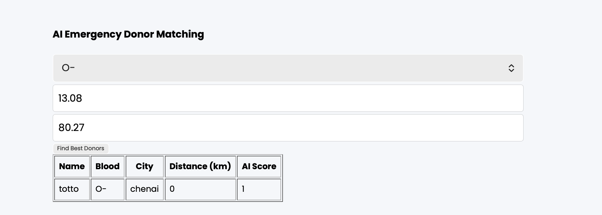
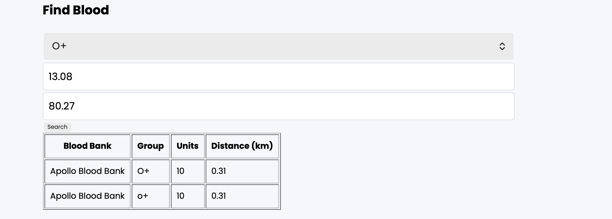
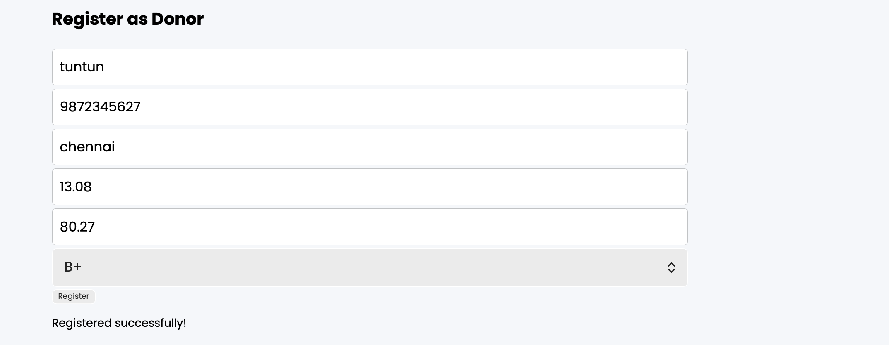
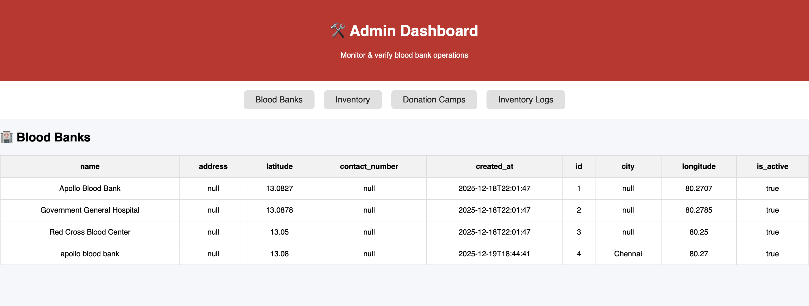
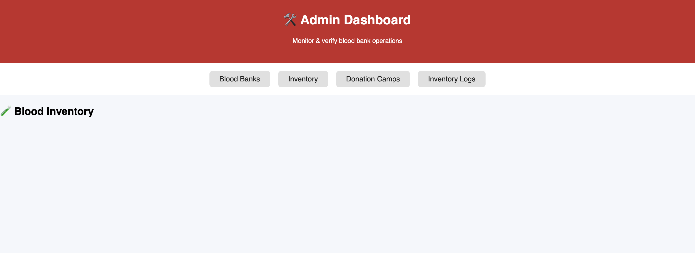
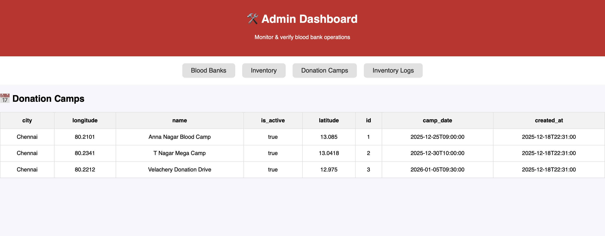
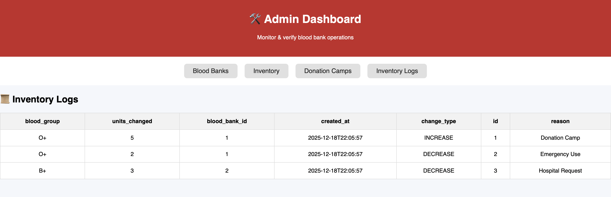

# AI-Assisted Smart Blood Bank Management System

A full-stack healthcare management system focused on real-time blood availability,
secure administrative workflows, and intelligent donor prioritization for emergency
scenarios.

---

## 🚀 Features

### Public Features
- Location-based blood bank discovery using geographic distance calculations
- Donor registration with validation and geospatial metadata
- AI-assisted emergency donor matching with priority scoring
- Public view of upcoming donation camps
- Inventory analytics and low-stock visibility

### Admin Features (JWT-Protected)
- Secure admin authentication using JWT
- Role-protected admin dashboard
- Blood bank, inventory, and donation camp management
- Inventory audit logs for traceability and accountability

---

## 🧠 AI-Assisted Decision Support
- Deterministic donor prioritization based on:
  - Blood group compatibility
  - Geographic proximity
  - Donor availability freshness
- Emergency-oriented ranking logic instead of blind notifications
- Explainable scoring designed for decision support, not black-box ML

---

##  Tech Stack
- **Backend:** FastAPI (Python)
- **Database:** SQLAlchemy ORM with SQLite (extensible to PostgreSQL)
- **Authentication:** JWT (Bearer tokens)
- **Frontend:** HTML, CSS, Vanilla JavaScript
- **API Documentation:** OpenAPI / Swagger
- **Architecture:** Layered (API → Services → Models)

---

##  Project Structure

```text
├── app/
│   ├── api/              # Public and admin API routes
│   ├── core/             # Configuration, database, security
│   ├── models/           # SQLAlchemy ORM models
│   ├── schemas/          # Pydantic request/response schemas
│   ├── services/         # Business logic layer
│   ├── utils/            # Authentication & shared utilities
│   └── main.py           # FastAPI application entry point
│
├── FRONTEND/
│   ├── index.html        # Public-facing UI
│   ├── admin.html        # Admin dashboard
│   ├── script.js         # Public JS logic
│   ├── admin.js          # Admin JS logic
│   └── styles.css
│
├── screenshots/          # Feature & UI screenshots
├── requirements.txt
└── README.md


## Authentication
All administrative operations are protected using JWT-based authentication
and enforced via role-based access control at the API layer.

---

##  Screenshots

###  AI Emergency Donor Matching


###  Find Blood (Location-Based Search)


###  Donor Registration


###  Admin Authentication (JWT)


###  Admin Dashboard – Blood Banks


###  Admin Dashboard – Inventory


###  Admin Dashboard – Donation Camps


###  Admin Dashboard – Inventory Logs



---

##  API Documentation
Swagger UI available at:
    http://localhost:8000/docs

---

##  Setup Instructions
```bash
pip install -r requirements.txt
uvicorn app.main:app --reload 

---

##  Author
**Amritha G**  
Computer Science Undergraduate  
GitHub: https://github.com/<Amritha-g>

